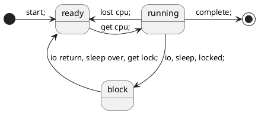
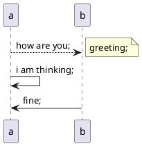
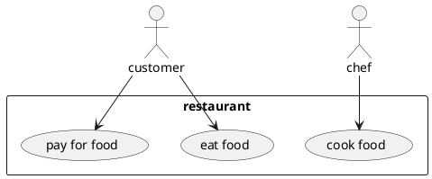
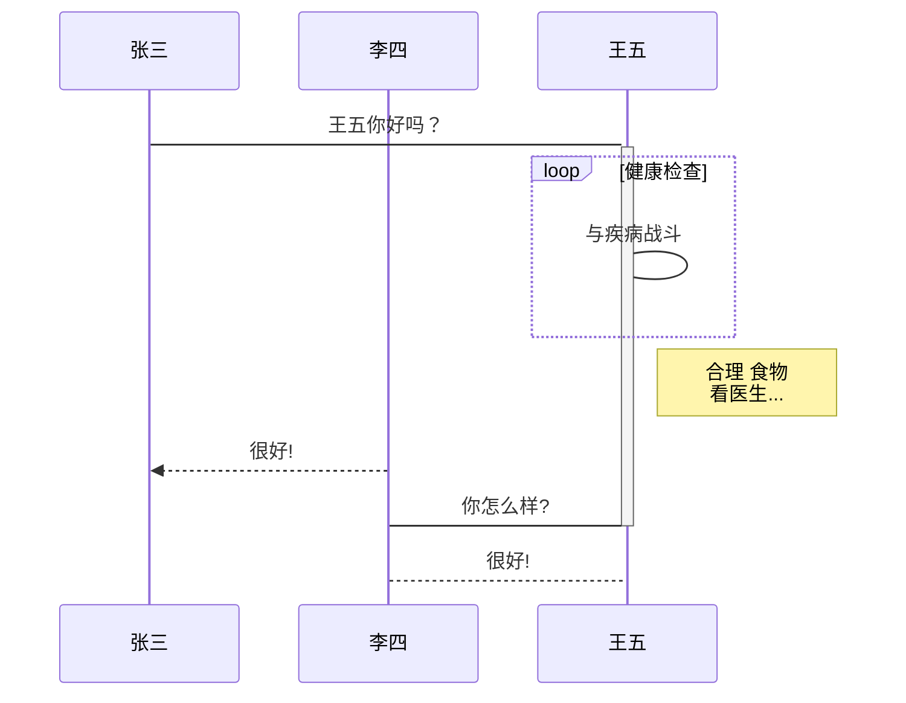
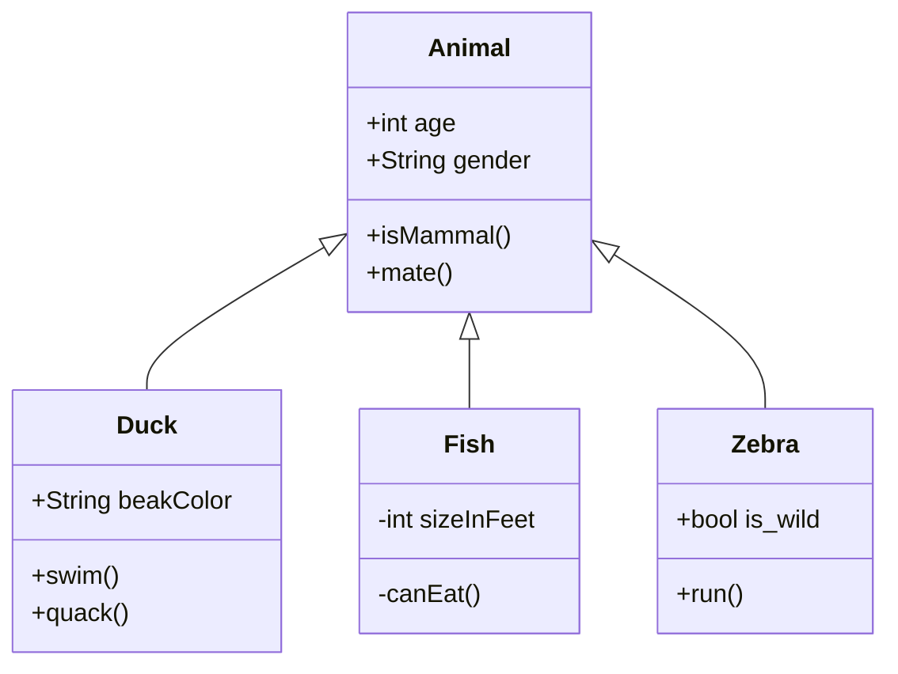

```plantuml
Bob -> Alice : 你好！
```

```plantuml
@startuml
[*] -> ready : start;
ready -> running : get cpu;
running -> ready : lost cpu;
running -down-> block : io, sleep, locked;
block -up-> ready : io return, sleep over, get lock;
running -> [*] : complete;
@enduml
```

```plantuml
@startuml
a --> b: how are you;
note right: greeting;
a -> a: i am thinking;
b -> a: fine;
@enduml 
```

```plantuml
@startuml
actor customer
actor chef
rectangle restaurant{
customer --> (eat food)
customer --> (pay for food)
chef --> (cook food)
}
@enduml
```

```mermaid

sequenceDiagram

    participant 张三

    participant 李四

    张三-> +王五: 王五你好吗？

    loop 健康检查

        王五->王五: 与疾病战斗

    end

    Note right of 王五: 合理 食物 <br/>看医生...

    李四-->>张三: 很好!

    王五-> -李四: 你怎么样?

    李四--> 王五: 很好!

```

```mermaid
classDiagram
      Animal <|-- Duck
      Animal <|-- Fish
      Animal <|-- Zebra
      Animal : +int age
      Animal : +String gender
      Animal: +isMammal()
      Animal: +mate()
      class Duck{
          +String beakColor
          +swim()
          +quack()
      }
      class Fish{
          -int sizeInFeet
          -canEat()
      }
      class Zebra{
          +bool is_wild
          +run()
      }

```